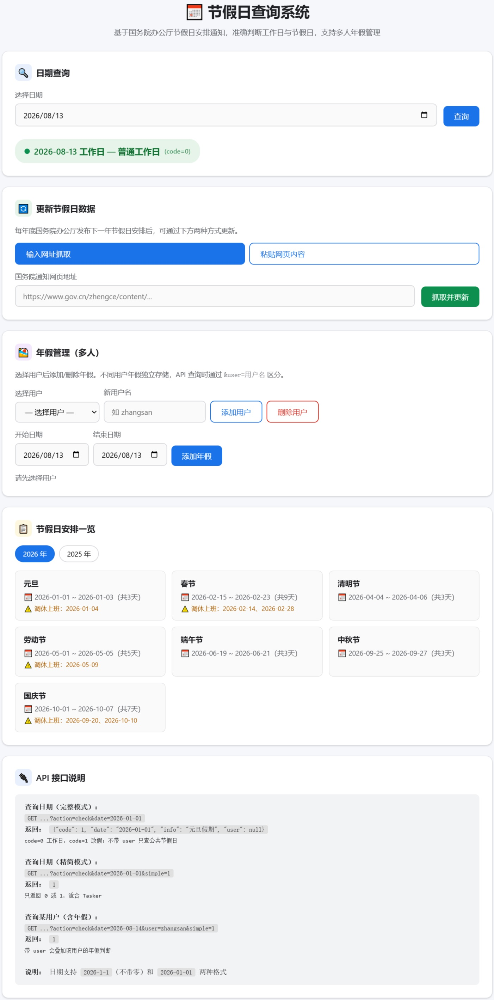

# 节假日查询系统

基于节假日安排通知的工作日判断系统，支持 API 查询、多用户年假管理、网页内容自动解析。

## 功能特性

- **工作日/节假日判断** — 输入日期，返回 0（工作日）或 1（放假）
- **RESTful API** — 支持完整模式和精简模式（仅返回 0/1），兼容 Tasker 等自动化工具
- **节假日数据更新** — 支持两种方式：输入放假通知网址抓取，或直接粘贴网页内容解析
- **多用户年假管理** — 每位用户独立管理年假，API 查询时按用户区分
- **自动年份清理** — 始终保持最近 2 年数据，更新新一年时自动清理旧数据
- **单文件部署** — 一个 PHP 文件 + 一个 JSON 数据文件，零依赖





## 快速开始

### 环境要求

- PHP 8.0+
- 无需数据库，数据存储在 `holidays.json`

### 部署

```bash
# 1. 将 index.php 和 holidays.json 上传到服务器同一目录
# 2. 确保 holidays.json 可写
chmod 666 holidays.json


# 或使用 Nginx/Apache 部署，入口文件为 index.php
```

### 浏览器访问

打开 `http://your-server/` 即可看到管理界面，支持：
- 日期查询
- 节假日数据更新
- 多用户年假增删管理

## API 接口

### 查询日期

**完整模式：**

```http
GET /?action=check&date=2026-01-01
```

响应：
```json
{
  "code": 1,
  "date": "2026-01-01",
  "info": "元旦假期",
  "user": null
}
```

**精简模式（仅返回 0 或 1，适合 Tasker）：**

```http
GET /?action=check&date=2026-01-01&simple=1
```

响应：
```
1
```

**带用户查询（含年假）：**

```http
GET /?action=check&date=2026-08-14&user=zhangsan&simple=1
```

> 日期格式兼容 `2026-1-1`（不带零）和 `2026-01-01` 两种写法。

### 更新节假日数据

**通过网址抓取：**

```http
POST /?action=update
Content-Type: application/json

{"url": "https://www.gov.cn/zhengce/content/202511/content_7047090.htm"}
```

**通过粘贴网页内容（适用于服务器无法访问外网）：**

```http
POST /?action=update
Content-Type: application/json

{"content": "（将国务院通知页面全文复制后粘贴在此）"}
```

响应示例：
```json
{
  "success": true,
  "year": "2026",
  "holiday_count": 33,
  "workday_count": 6,
  "holiday_names": [...],
  "keep_years": ["2026", "2025"],
  "message": "成功解析 2026 年节假日安排，共 33 天假期，6 天调休上班。当前保留年份：2026、2025"
}
```

### 获取节假日列表

```http
# 获取所有可用年份
GET /?action=list

# 获取指定年份详情
GET /?action=list&year=2026
```

### 年假管理

```http
# 获取所有用户
GET /?action=users_list

# 获取某用户年假列表
GET /?action=annual_list&user=zhangsan

# 添加年假
POST /?action=annual_add
Content-Type: application/json

{"user": "zhangsan", "dates": ["2026-08-14", "2026-08-15"]}

# 删除年假
POST /?action=annual_remove
Content-Type: application/json

{"user": "zhangsan", "dates": ["2026-08-14"]}
```

### 诊断

```http
GET /?action=diag
```

返回服务器环境诊断信息（PHP 版本、扩展、权限等）。

## 判断逻辑

优先级从高到低：

1. **年假** — 用户指定了年假日期 → 放假
2. **调休上班日** — 国务院规定周末调休上班 → 工作日
3. **法定节假日** — 国务院规定的节假日 → 放假
4. **默认规则** — 周一至周五为工作日，周六周日为休息日

## 数据存储

`holidays.json` 结构：

```json
{
  "YYYY": {
    "holidays": ["YYYY-MM-DD", ...],
    "workdays": ["YYYY-MM-DD", ...],
    "holiday_names": [{
      "name": "春节",
      "start": "2026-02-15",
      "end": "2026-02-23",
      "days": 9,
      "makeup": ["2026-02-14", "2026-02-28"]
    }],
    "updated_at": "2026-08-11T15:15:45+00:00",
    "source_url": "https://www.gov.cn/..."
  },
  "annual_leave": {
    "zhangsan": ["2026-08-14", "2026-08-15"],
    "lisi": ["2026-09-01"]
  }
}
```

系统自动保持最近 2 年数据，更新新年份时自动清理旧年份。

## 使用场景

- **Tasker / 自动化** — 通过 `simple=1` 精简模式，每天定时请求判断当天是否上班
- **NAS 自部署** — 单文件架构，适合威联通、群晖等 NAS 设备
- **多人团队** — 通过 `user` 参数区分不同成员的年假，API 独立返回
